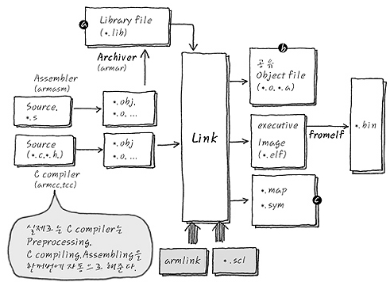

#Compile

========
- - -
1. 전처리기(Preprocessor)   
   Layer1   
   C processor와 link Processor를 이용하여 Syntax적인 것들을 정리한다   
   즉 선언된 macro, #define,#include 등을 compile 전에 교체하고, syntax error가 있는 지 점검하여 컴파일을 할 수 있는 단계까지 준비한다.   
   include를 선언하는 단계에서 " ", < > 의 차이점은 <>는 Compiler에 미리 설정된 path로 부터 Header파일을 찾아가는 것이고, " " 는 컴파일 하는 컴파일중인 디렉토리를 우선적으로 Header 파일을 찾는다.없을시에 Predefine에서 검색을 한다.   
   여러개의 파일이 하나의 헤더파일을 접근할 경우 #ifndef,#endif를 통해서 문제를 해결 할 수 있다.   
   옵션 -E를 통해서 Preprocess를 할 수 있다.(*.c --> *.i)   
   옵션 -I를 통해서 컴파일 중 include path를 설정할 수 있으며 -J옵션을 통해 Compiler Default include path를 설정할 수 있다.   
   
   Layer2   
   1. 주석 제거: 소스코드에서 주석을 제거한다.   
   2. 헤더 파일 삽입: #include를 만나면 해당하는 헤더파일을 찾아 헤더파일에 있는 모든 내용을 복사하여 소스 코드에 삽입한다. 즉 헤더 파일은 컴파일에 사용되지 ㅇ낳고 소스 코드 파일 내에 전부 복사되고 헤더파일에 선언된 함수 원형은 링킹 과정을 통해서 실제로 함수가 정의되어 있는 오브젝트 파일과 결합한다.   
   3. 메크로 치환 및 적용: #define에 정의된 메크로를 저장하고 같은 문자열을 만나면 정의된 내용으로 치환한다.   
- - -
 2. 컴파일러(Compiler)   
   Layer1   
   High level language를 low level language로 변환한다.   
   옵션 -S 를 사용하여 *.s파일 형식으로 어셈블리(low level language)로 생성할 수 있다.   

   Layer2   
   1. 소스 코드가 해당 언어로 올바르게 작성되었는지 확인한다.(어휘,구문,의미분석)   
   2. 아키텍쳐 비종속적인 최적화를 수행 --> 아키텍쳐와 상관없이 수행할 수 있는 최적화를 실행
   3. 아키텍쳐 종속적인 최적화를 수행 --> 아키텍쳐에 따라서 최적화를 수행한다.   
- - -
 3. 어셈블러(Assembler)   
   Layer2    
   *.s --> *.o   
   Assembly language에서 기계어로 변환이 이루어지며 .o 형태로 나타난다.   
   Object 파일 포맷 종류는 PE(Window 환경,Portable executable), ELF(Linux 환경,Executable and Linking Format) 나누어 진다.   
- - -
 4. 링커(linker)   
  Layer1   
  Linker란 link시에 실제 함수 정의부의 위치와 전역변수들의 위치를 library file과 object file에서 차례대로 조사한 후에 Table로 저장하여, 그 주소를 함수호출 코드 부분에 기록해 넣는다.   

  Linker Placement Rule를 통해서 Section끼리 모으는데 input section은 각 object file의 symbol들이 알파벳 순서대로 정리되어있고 이런 input section들이 output section을 이루고 output section이 region을 이루게 된다.   
 
  * Scatter loading file(scl)란 원하는 영역에 symbol들을 특성에 따라 위치 시킬수 있는 Linker Script이다.   

  Layer2   
  다양한 object를 연결하여서 ELF 파일을 생성한다.   
  1. Symbol Resolution: 각 오브젝트 파일에 있는 심볼 참조를 어떤 심볼 정의에 연관 시킬지 결정하는 과정이다.   
  2. Relocation: 오브젝트 파일에 있는 데이터의 주소나 코드의 메모리 참조 주소를 알맞게 배치하는 과정이다.   
  - - -