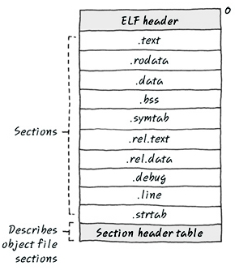

#ELF
===========

- - -
1. Executable ELF format image   
Layer1   
* 모든 iput object file들의 모든 코드와 데이터를 가지는 실행 가능한 새로운 object file을 만들어 내는데 이때 각각의 object file들이 가지는 text, bss, data를 모두 새로운 text, bss, data에 모은다.   
* Linker Placement Rule로 같은 종류의 Input section들을 모아 알파벳순으로 정리하여 Output section으로 묶고 그러한 Output section들을 모아 알파벳순으로 정리하여 Region을 이루게 한다.   
- - -

2. ELF relocatable object file   
Layer1   
.rel.text: text에 들어있는 각 머신 코드의 위치를 나타내며, Linker가 이 오브젝트 파일을 다른 오브젝트 파일들과 연결할 때 사용한다.   
.text: compile된 기계어(op code)가 위치한다.   
.rodata: read-only data를 의마하며, const로 선언된 바뀌지 않는 data들이 들어 있고, switch case문에 의한 jump table도 포함되어 있다.  
.bss: 0으로 초기화 되는 전역변수들이 들어있으며 이러한 전역변수들은 실제 이 section에 자신의 크기만큼 잡혀있지 않다.   
.symtab: symbol table이며, 전역변수 이름과 함수이름으로 이루어져 있다.
.rel.text: relocatable text이며 Op code가 들어있다. symbol reference resolving에서 Linker가 다른 오브젝트 파일과 연결하여 채워넣는 부분으로 executable object에 없는 section이다.   
.rel.data: rel.text와 마찬가지로, 현재 파일에서 정의되어 있지 않고, link시에 참조되는 전역 변수에 대한 재배치 정보를 담고 있으며, extern 전역변수나 extern 함수의 이름들이 들어 있다.
.debug: -g option에 의해 생성되는 debug symbol table으로 지역, 전역 변수들에 대한 일반적으로 DWARF형식의 debugging symbol이 존재한다.   
.line: -g option으로 compile할 경우, text section의 opcode와 원본 C의 line을 연결하여, code를 보면서 debugging을 가능하게 한다.   
.strtab: .symtab와 .debug section에 사용되는 const data인 string, section header의 section 이름들도 존재한다.   
- - -

3. Executable Object File   
Layer1   
Segment는 Section들의 집합이며 같은 속성의 section들을 모아서 한 segment안에 넣으며 크게 Code segment와 Data segment로 나누어 진다.   
ELF header에는 file이 실행될 때, 시작되어야 하는 entry point address가 있고, rel.* section들은 다 없어진다.   
.init section의 용도는 OS가 있는 시스템에서 ELF가 실행될 때 실행되기 전에 initialization을 하는 작은 Code가 들어있고, 또 Program header가 들어가 있다.program header를 통해서 실행하는데 필요한 정보들을 넣어 준다.   

- - -
4. etc   
Layer1   
같은 이름의 Global symbol priority는 weak와 strong으로 나누어진다.함수와 초기화가 된 전역변수는 Strong을 분류하고, 초기화가 되지 않은 전역변수는 Weak라고 분류를 한다.   
* 여러 개의 Strong symbol이 있을 경우에는 Link error 발생   
* 하나의 Strong Symbol과 여러 개의 Weak Symbol이 있다면, Strong Symbol 선택   
* 여러 개의 Weak Symbol이 있다면, Random하게 골라 선택   

Embedded system에서는 Code segment중 text,rodata를 RO라고 칭하고, data를 RW라는 두 개 section으로 나눈 binary가 실행될 수 있다.   