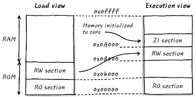

#Load view & Execution view
==============

- - -
1. Load View란 Software가 실행되기 전에 저장매체에 담겨 있을 때의 모습이며, 
Execution Veiw는 Software가 실행 되었을 때의 모습을 나타낸다.   
Layer1   
* 두개의 view가 다른 이유는 Load View에서 RW가 자리잡고 있어, Readable,Writable하기 때문에 Flash에 자리잡고 있던 RW를 실행 상태에서는 RAM으로 복사해야 한다.   
* RO의 경우 XIP(Execution In Place) NOR Flash에서는 XIP가 가능하므로 Load View와 Execution View가 같을 수 있다 왜냐하면 Flash에 Loading된 상태 그대로에서 Execution이 가능하기 때문이다.   
* 하지만 NAND Flash에서는 Loading된 상태 그대로에서 Execution이 불가능하고 XIP가 가능한 SDRAM같은 메모리로 옮겨져야 한다.   
* Load View에는 ZI가 따로 잡히지 않는데 그 이유는 값이 0이기 때문에 Load View에서 만들어 놓을 이유가 없지만 Execution View에서는 있어야 한다.   
- - -

2. Scatter Loading Examples   
Layer1  
''' 
LOAD ROM 0x0{   
    EXEC_ROM 0x0   
    {   
        *.o(+RO)   
    }   
    EXEC_RAM1 0x8000{   
        *.o(+RW)   
    }   
    EXEC_RAM2 0xA000{   
        *.o(+ZI)   
    }   
}   
'''
- - -